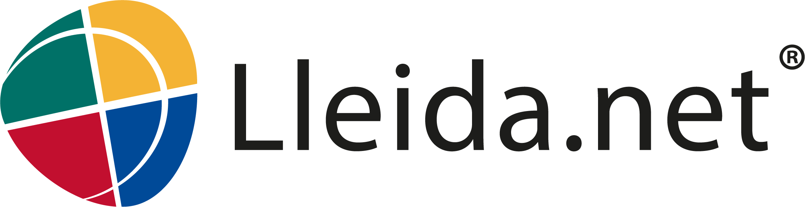
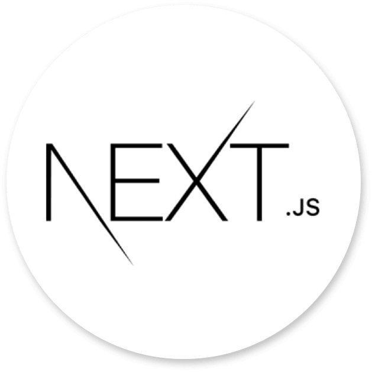
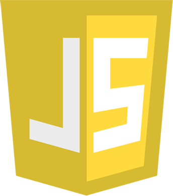
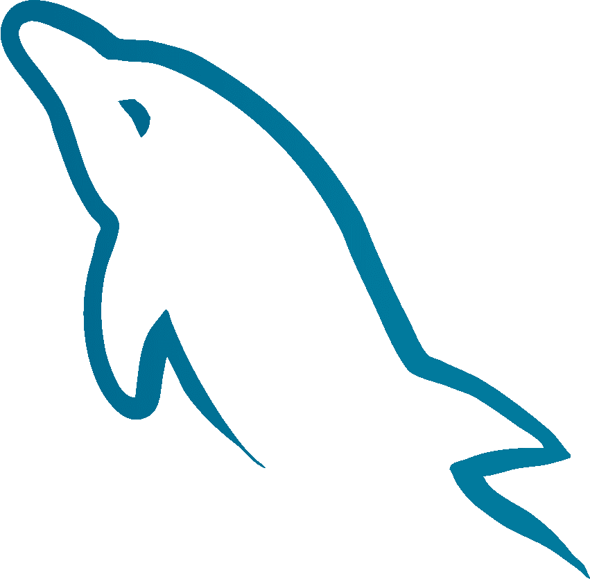
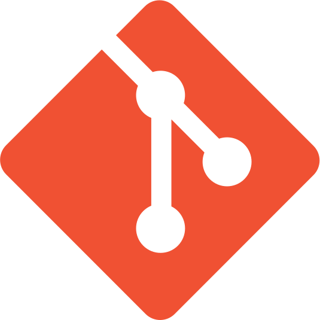
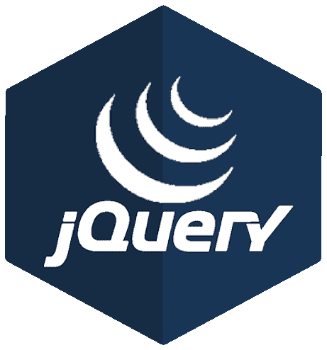
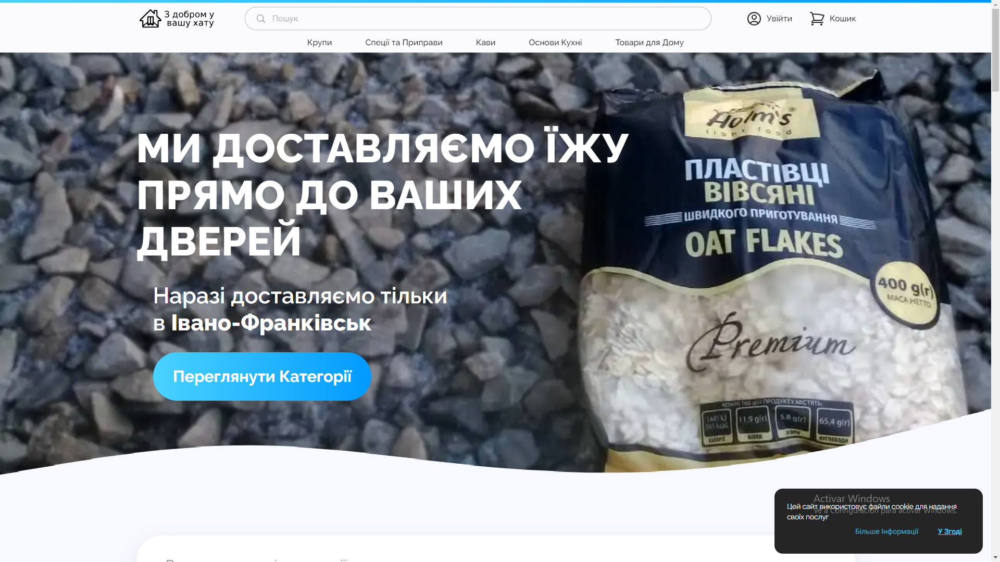
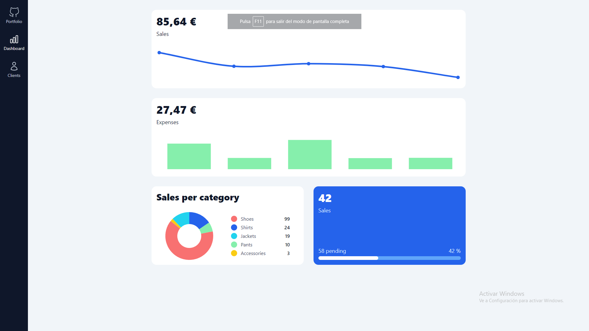

# Hola Mundo, soy Oleg! 👋

    

Soy un apasionado programador con varios años de experiencia en el desarrollo de páginas web. Mi enfoque se centra en crear soluciones de forma rápida y eficiente. Me especializo en JavaScript y puedo aprender lenguajes y/o frameworks de manera rápida y autodidacta.

## Experiencia

### Desarrollador front-end (feb. 2021 - actualidad)

Me dedico a crear y mantener páginas web. Uso JavaScript, PHP, MySQL, jQuery, Git...

 

### Desarrollador de aplicaciones (jun. 2019 - mar. 2020)

Me dedique a mejorar y mantener una parte del ERP de la empresa.

### Técnico informático (oct. 2017 - mar. 2018)

Me dediqué a mantener y reparar ordenadores. También configure, actualice e instale programas de diversa índole. Además, también diseñé una de las páginas webs.

## Tecnologías que uso o use

<code></code>
<code></code>
<code></code>
<code></code>
<code></code>
<code></code>
<code></code>
<code></code>
<code></code>
<code></code>
<code></code>

## Proyectos que programé

Página web de comercio electrónico que programe para un cliente. Es muy completa, incluye funcionalidades como: registro, login, carrito de compras, posibilidad de escoger la fecha de entrega, historial de pedidos de usario, posibilidad de anulación de pedido, entre otros.

Lo desarrollé con Next.js 12 + MUI 5, y como base de datos escogí MySQL. Todo esto esta subido en un Linode, un proveedor de VPS, y corriendo en nginx.

 

Back-office 100% responsive con graficos, una tabla de clientes, y acciones varias que se pueden hacer con los clientes.

Lo desarrollé con React 18 + react redux + Tailwindcss + chart.js.

 

    

